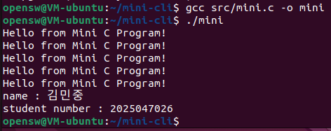
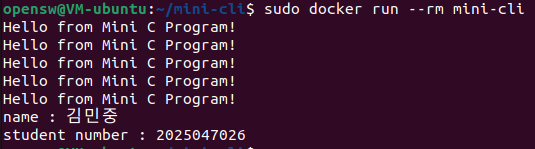

# 오픈소스 소프트웨어 이해와 실습 과제

> 2025047026 김민중

---

# 🛠️ Mini CLI Tool Project

> 간단한 CLI 프로그램을 제작하고, Linux 실행 및 Docker 패키징, GitHub 버전관리 실습을 수행한 프로젝트입니다.

---

## 📁 프로젝트 구조

```
mini-cli/
 ├─ src/
 │   └─ mini.c
 ├─ Dockerfile
 ├─ README.md
 ├─ LICENSE
 └─ docs/
     └─ images/
```

---

## 🚀 1. Mini 프로그램

### ✔ 코드


```c
#include <stdio.h>
int main() {
    for (int i = 0;i < 5;i++) {
        printf("Hello from Mini C Program!\n");
    }
    printf("name : 김민중\n");
    printf("student number : 2025047026\n");
    return 0;
}
```

---

## 🧪 2. Linux 실행 결과

### ✔ 실행 명령어
```bash
# 개발 환경 설치 과정
sudo apt update
sudo apt install -y build-essential

# 실행 과정
gcc src/mini.c -o mini
./mini

#실행 결과
Hello from Mini C Program!
Hello from Mini C Program!
Hello from Mini C Program!
Hello from Mini C Program!
Hello from Mini C Program!
name : 김민중
student number : 2025047026
```

### 실행 화면 캡처  


---

## 3. Dockerfile 및 실행 결과

### ✔ Dockerfile
```Dockerfile
FROM ubuntu:24.04
WORKDIR /app
COPY src/mini.c .
RUN apt update && \
    apt install -y gcc && \
    gcc mini.c -o mini
CMD ["./mini"]
```


### ✔ Docker 이미지 빌드
```bash
docker build -t mini-cli .

#빌드 결과
[+] Building 2.8s (9/9) FINISHED                                                                    docker:default
 => [internal] load build definition from Dockerfile                                                          0.0s
 => => transferring dockerfile: 174B                                                                          0.0s
 => [internal] load metadata for docker.io/library/ubuntu:24.04                                               2.2s
 => [internal] load .dockerignore                                                                             0.0s
 => => transferring context: 2B                                                                               0.0s
 => [1/4] FROM docker.io/library/ubuntu:24.04@sha256:c35e29c9450151419d9448b0fd75374fec4fff364a27f176fb458d4  0.1s
 => => resolve docker.io/library/ubuntu:24.04@sha256:c35e29c9450151419d9448b0fd75374fec4fff364a27f176fb458d4  0.1s
 => [internal] load build context                                                                             0.0s
 => => transferring context: 279B                                                                             0.0s
 => CACHED [2/4] WORKDIR /app                                                                                 0.0s
 => CACHED [3/4] COPY src/mini.c .                                                                            0.0s
 => CACHED [4/4] RUN apt update &&     apt install -y gcc &&     gcc mini.c -o mini                           0.0s
 => exporting to image                                                                                        0.2s
 => => exporting layers                                                                                       0.0s
 => => exporting manifest sha256:7c7a7a36786f9d10df0e10690b857d1149538c7e5fb8e3f5c98f30d59979a2df             0.0s
 => => exporting config sha256:687c81153aa9898b8bd806026511a2cb97e9703628259851d5c9331b7a3b1c3a               0.0s
 => => exporting attestation manifest sha256:8ceb26849e444ad2c69aab9e9ffbc39990dececa04d3739bd7ffc49cc87d0f5  0.1s
 => => exporting manifest list sha256:235b1694b746686810049fd93e506aff91d872a2e88f8095a496e884b6b8c84c        0.0s
 => => naming to docker.io/library/mini-cli:latest                                                            0.0s
 => => unpacking to docker.io/library/mini-cli:latest                                                         0.0s
```

### ✔ Docker 실행
```bash
docker run --rm mini-cli

#실행 결과
Hello from Mini C Program!
Hello from Mini C Program!
Hello from Mini C Program!
Hello from Mini C Program!
Hello from Mini C Program!
name : 김민중
student number : 2025047026
```

### ✔ 실행 화면 캡처  


---

## 4. GitHub 버전관리 내역

### 체크리스트
- [x] Commit 5회 이상  
- [x] Branch 생성  
- [x] Branch → main Merge  
- [x] 의미 있는 Commit 메시지  

### 설명

``
feature/mini-program 브랜치를 생성해 mini.c을 수정하고 main으로 merge함.
feature/docker 브랜치를 생성해 Dockerfile을 수정하고 main으로 merge함.
커밋 메시지 작성 시 `Feat`, `Docs`, `Build` 등의 접두어를 사용하여 해당 커밋의 변경 성격을 명확히 설명함.
```

### 캡처


---

## 5. LICENSE 파일

```
본 프로젝트는 { MIT } License를 적용합니다.
```

---

## 6. 고찰

- 배운 점:  개발자가 되기 위해서는 코드만잘짜는 것뿐만 아니라, 코드를 관리하는 도구와 실행하는 환경까지 이해하고 활용할 수 있어야 한다는 것을 배웠습니다. README.md를 작성하면서 프로젝트를 문서화하는 작업 또한 개발의 중요한 일부분이라는 것을 알게되었습니다.
- 어려웠던 점:  사소한 오타나 명령어 실수로 인해 에러가 발생했을 떄 원인을 찾는 과정이 힘들었습니다. 하지만 직접 문제에 관해 인터넷에서 찾아보고 문제를 스스로 해결하면서 문제 해결 능력이 길러진 것 같습니다. 커밋이나 브랜치를 하는 과정에서 실수를 했을때 해결하는 방법을 알지 못 해서 처음부터 다시 프로젝트를 시작하는 과정은 많이 힘들었지만 처음부터 여러번 다시 시작하면서 커밋이나 브랜치에 대한 이해가 늘었습니다.
- 흥미로웠던 부분:  지금까지는 비주얼 스튜디오만을 사용해서 코드 작성만 하였는데 이번 프로젝트를 통해 듣기만 했었던 Git과 Docker를 직접 사용해보면서 개발 과정에 대한 경험을 해본 것 같아서 유익했습니다. 아직은 많이 경험해보지 못 해서 버벅이고 실수가 많았지만 그 과정 속에서 많은 것들을 배울 수 있었습니다. 문서화 작업을 통해  프로젝트에 대한 이해을 높일 수 있고 한 눈에 프로젝트에 대한 정보를 제공할 수 있다는 점이 좋다고 생각했습니다.
- 개선하고 싶은 점:  이번에는 혼자서만 프로젝트를 진행했는데다음에 기회가 된다면 팀원과 함께 저장소를 공유하고 그 과정에서 발생하는 충돌 상황을 직접 경험하고 해결해보면서 협업 능력을 더 기르고 싶습니다. 브랜치에 대한 이해가 적어서 활용을 제대로 해보지 못 한 것 같아서 다음에는 브랜치를 더 활용하는 방법을 배워서 프로젝트를 진행하고 싶습니다.

---

## 7. 참고 자료

- https://docs.docker.com/engine/install/ubuntu/
- https://github.com/  
- https://www.olis.or.kr/license/Detailselect.do?lId=1006
- https://gcc.gnu.org/  
- https://choosealicense.com/
